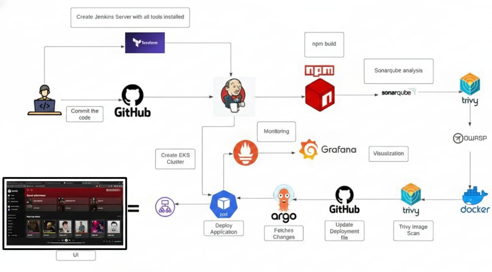

---

# 🎵🚀 DevSecOps: Deploy Spotify Clone to Amazon Elastic Kubernetes Service (EKS) using ArgoCD and Monitor with Prometheus & Grafana ✨

<p align="center">
  
</p>

---

# 🚀 Introduction

In modern cloud-native development, speed alone is not enough — applications must be secure, scalable, observable, and fully automated. This is where **DevSecOps** comes in.

In this project, we implement a complete **End-to-End DevSecOps pipeline** to deploy a **Spotify Clone application** on **Amazon Elastic Kubernetes Service (EKS)** using **ArgoCD (GitOps)** and monitor it using **Prometheus & Grafana**.

This project demonstrates:

* Infrastructure as Code using Terraform
* CI pipeline using Jenkins
* Containerization with Docker
* Security scanning with Trivy
* GitOps Continuous Delivery with ArgoCD
* Kubernetes deployment on AWS EKS
* Monitoring & Observability


---

## 🤝 Why ArgoCD and AWS EKS?

### 1️⃣ GitOps Workflow

**ArgoCD** follows the GitOps model where the desired Kubernetes state is stored in Git.
Whenever code changes, ArgoCD automatically syncs and deploys the updated application.

Benefits:

* Version control for infrastructure
* Automatic synchronization
* Self-healing deployments
* Easy rollback

---

### 2️⃣ Managed Kubernetes with EKS

**Amazon EKS** provides a fully managed Kubernetes control plane, allowing you to focus only on application deployment without worrying about cluster management.

Together, **EKS + ArgoCD** provide:

✔ Secure and scalable deployments
✔ Automated application lifecycle
✔ Infrastructure + Application as Code

---

### 3️⃣ Continuous Integration with Jenkins

Jenkins automates:

* Docker image build
* Trivy vulnerability scanning
* Push image to DockerHub
* Automatically Update Kubernetes Deployment File in GitHub
* Update Kubernetes manifests
  
After pushing the Docker image, Jenkins:

* Updates the image tag in k8s/deployment.yaml
* Uses the Jenkins build number as the image version
* Commits the updated file
* Pushes changes back to GitHub automatically
* This ensures every build is secure and production-ready.

---

### 4️⃣ Monitoring & Observability

Using **Prometheus & Grafana**, we monitor:

* Kubernetes cluster metrics
* Pod performance
* Application health
* Resource utilization

This ensures high availability and production-level visibility.

---

# 🛠️ Steps to Implement

---

## 🔹 Step 1: Provision Infrastructure using Terraform

Navigate to terraform directory:

```bash
cd terraform
terraform init
terraform apply --auto-approve
```

This provisions:

* VPC
* Subnets
* IAM Roles
* EKS Cluster
* Node Group

Configure kubectl:

```bash
aws eks update-kubeconfig --name spotify-eks-cluster --region ap-south-1
kubectl get nodes
```

---

## 🔹 Step 2: Setup Jenkins CI Pipeline

1. Install Jenkins on EC2
2. Configure required credentials (AWS, DockerHub, GitHub)
3. Create Pipeline using:

```
jenkins/Jenkinsfile
```

Pipeline performs:

* Clone GitHub repo
* Build Docker image
* Run Trivy scan
* Push image to DockerHub
* Update Kubernetes deployment file

---

## 🔹 Step 3: Install and Configure ArgoCD

Create namespace and install ArgoCD:

```bash
kubectl create namespace argocd
kubectl apply -n argocd -f https://raw.githubusercontent.com/argoproj/argo-cd/stable/manifests/install.yaml
```

Deploy application via:

```bash
kubectl apply -f argocd/spotify-app.yaml
```

ArgoCD will:

* Track Git repository
* Automatically deploy to EKS
* Self-heal configuration drift

---

## 🔹 Step 4: Deploy Monitoring Stack

Create monitoring namespace:

```bash
kubectl create namespace monitoring
kubectl apply -f monitoring/
```

This installs:

* Prometheus
* Grafana
* Node Exporter

Access Grafana via NodePort service and configure Prometheus as data source.

---

# 🔍 Monitoring & Metrics

Prometheus collects:

* Cluster metrics
* Node metrics
* Pod health
* Application performance

Grafana provides dashboards to visualize:

📊 CPU usage
📊 Memory usage
📊 Pod status
📊 Service health

This ensures real-time observability.

---

# 🔄 Complete DevSecOps Workflow

```
Developer Push → GitHub
        ↓
Jenkins CI Pipeline
(Docker Build + Trivy Scan)
        ↓
Push Image to DockerHub
        ↓
Jenkins Updates Image Tag in GitHub (deployment.yaml)
        ↓
ArgoCD Sync
        ↓
Deploy to AWS EKS
        ↓
Prometheus Collects Metrics
        ↓
Grafana Dashboards
```

---

# 🎯 Key Highlights

✔ Infrastructure as Code (Terraform)
✔ Secure CI with Trivy scanning
✔ GitOps Continuous Deployment
✔ AWS Managed Kubernetes (EKS)
✔ Full Monitoring & Observability
✔ Production-Ready Architecture

---

# 🧹 Cleanup (Avoid AWS Charges)

```bash
cd terraform
terraform destroy --auto-approve
```

---

# 🔄 Conclusion

This project demonstrates a real-world DevSecOps pipeline integrating:

* Jenkins
* Docker
* Terraform
* AWS EKS
* ArgoCD
* Prometheus
* Grafana

It showcases how automation, security, scalability, and monitoring come together to build a production-ready cloud-native system.

---

# 👨‍💻 Author

**Anant**
DevOps & Cloud Enthusiast 🚀

If you found this helpful, consider starring ⭐ the repository!
